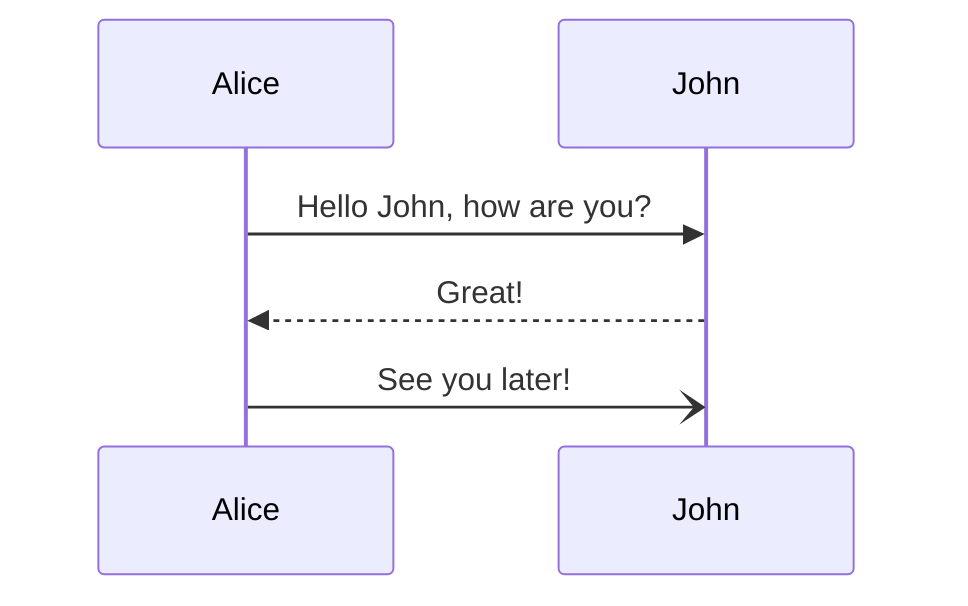

# Spring Initializr Enhancement by Browser Extension

Since [Spring Initializr](https://start.spring.io) doesn't support push the generated project to github, so this extension is going to add the button for it.

# Features

* Push to GitHub Button
* Configure Options
  * Enable GitHub Actions
  * Enable GitHub Dependbot
  * Enable GitHub CodeSpaces
  * Enable Run on Azure Spring Cloud

# How

There are two ways to implement these features above:

* Purely locally within this browser extension
* With Server

## With Server

Using a server, we can make this client (brower extension) extreamly lite, since the heavy work is delegated to server

For example, the origin generated project url looks like this `https://start.spring.io/#!type=maven-project&language=java&platformVersion=3.0.2&packaging=jar&jvmVersion=17&groupId=club.stliu.spring&artifactId=spring-initializr-extension&name=Spring%20Initializr%20Extension%20Server&description=Spring%20Initializr%20Extension%20Server&packageName=club.stliu.spring.initializr.extension&dependencies=native,cloud-task,web`


So when click the button of `push to github`, it sents a request to the backend server

```
GET https://localhost:8080/github/#!type=maven-project&language=java&platformVersion=3.0.2&packaging=jar&jvmVersion=17&groupId=club.stliu.spring&artifactId=spring-initializr-extension&name=Spring%20Initializr%20Extension%20Server&description=Spring%20Initializr%20Extension%20Server&packageName=club.stliu.spring.initializr.extension&dependencies=native,cloud-task,web
```

Since there is no Github `code`, which means user is not logined, so the github api should response a `307` to redirect browser to the github login page first

The browser extension should cache the code, since it expires in 10 mintues 

```
location: https://github.com/login/oauth/authorize?scope=public_repo%2Cread%3Auser%2Cworkflow&client_id=0904eaa0041181ef0375&redirect_uri=https%3A%2F%2Flaunch.micronaut.io%2Fgithub%2Fdefault%2Fcom.example.demo%3Flang%3DJAVA%26build%3DGRADLE%26test%3DJUNIT%26javaVersion%3DJDK_11&state=c46bd43d-7d3d-4971-85a0-e68c4777427f
```

How Micronaut does this:

1. [Github Scopes](https://docs.github.com/en/developers/apps/building-oauth-apps/scopes-for-oauth-apps)
  * public_repo
  * read:user
  * workflow
2. Using UUID as state, which is required as a random string




## Local Only


# Local Development

Please reference [this doc](https://developer.chrome.com/docs/extensions/mv3/getstarted/development-basics/#load-unpacked) to load this development stage code into your Chrome.

# Reference

[1ES Open Source Assistant](https://ospo.visualstudio.com/OSPO/_git/opensource-extension)

This projects shows how to build extensions for:

* Edge
* Chrome
* Firefox

And it also shows the telemetry tracking
